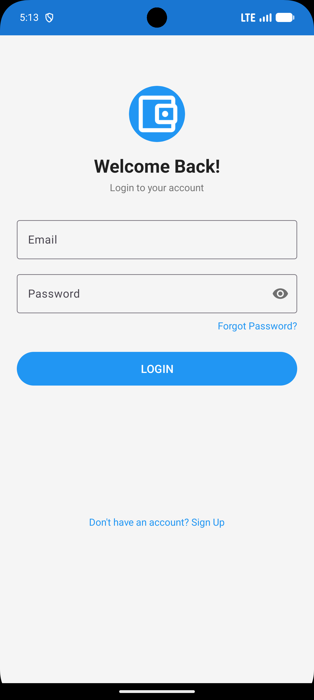
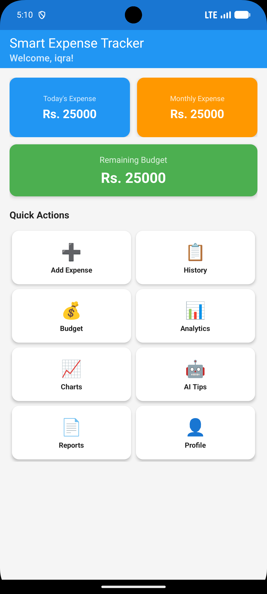
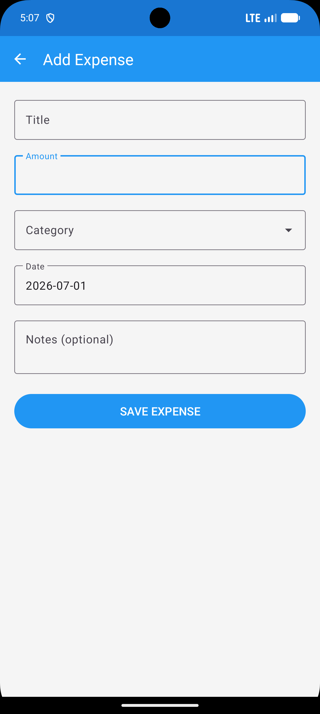
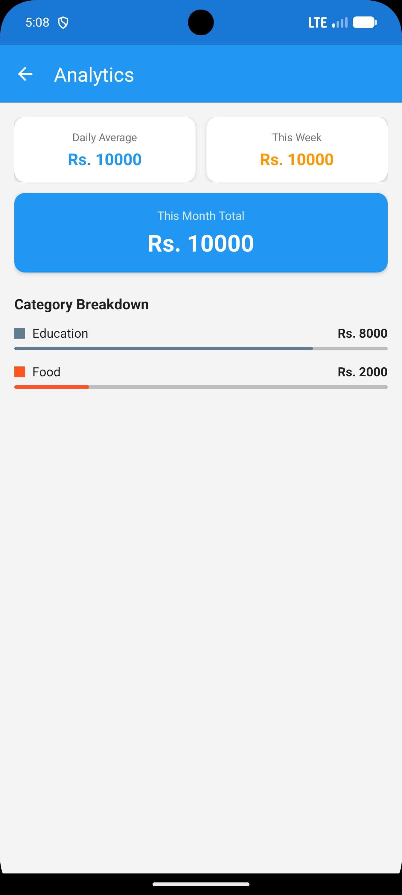
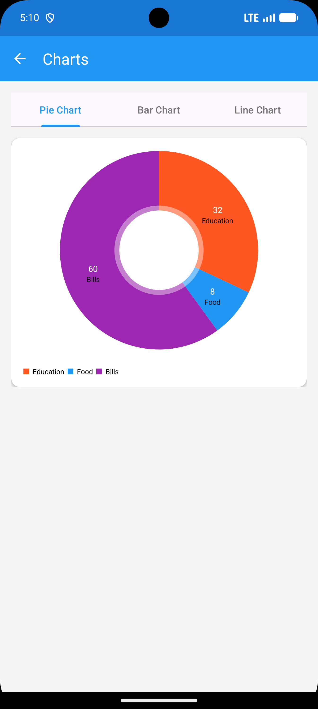
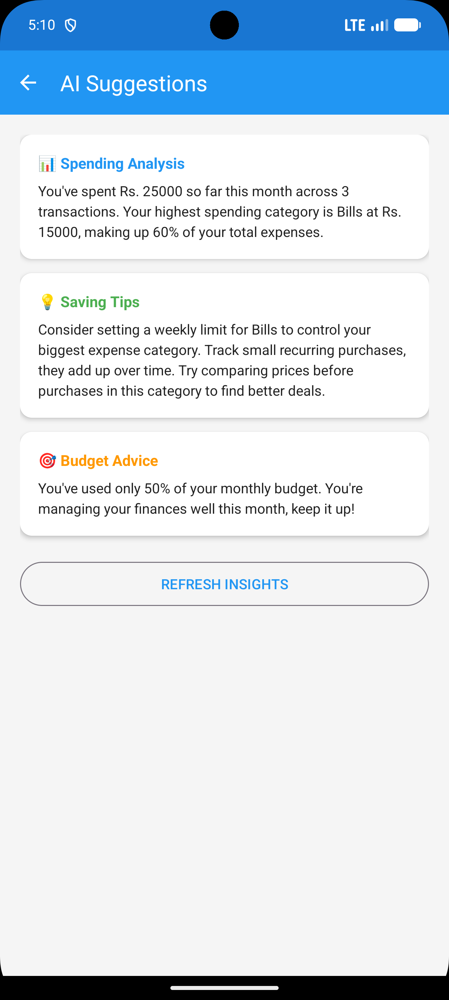

# Smart Expense Tracker

> An Android application for tracking daily expenses, managing budgets, and receiving AI-powered spending insights.


---

## Overview

Smart Expense Tracker helps users take control of their personal finances through an intuitive mobile experience. The app works fully offline and uses Gemini AI to analyse spending patterns and suggest improvements.

---

## Features

- **Expense Management** — Add, view, edit and delete expenses with title, amount, category, date and notes
- **Budget Planner** — Set a monthly budget and track remaining balance with a visual progress bar
- **Analytics** — Daily average, weekly total, monthly total and category-wise breakdown
- **Visual Charts** — Pie, Bar and Line charts powered by MPAndroidChart
- **AI Spending Insights** — Gemini AI analyses your expenses and returns personalised saving tips and budget advice
- **PDF Reports** — Generate and share a monthly expense report as a PDF file
- **Smart Notifications** — Daily expense reminders, budget warnings at 90% usage, and monthly report alerts via WorkManager
- **Offline First** — All expense and budget data stored locally using Room Database
- **Secure Auth** — Firebase email/password authentication with email verification

---

## Screenshots

> Add your app screenshots here

| Login | Dashboard | Add Expense |
|-------|-----------|-------------|
|  |  |  |

| Analytics | Charts | AI Suggestions |
|-----------|--------|----------------|
|  |  |  |

---

## Tech Stack

| Technology | Purpose |
|------------|---------|
| Java | Primary programming language |
| XML + Material Design 3 | UI layouts and components |
| MVVM + Repository Pattern | Architecture |
| Room Database | Local offline storage |
| Firebase Authentication | User login, signup and verification |
| Gemini 2.0 Flash API | AI spending analysis |
| Retrofit + OkHttp | Network layer for Gemini API |
| MPAndroidChart | Pie, Bar and Line charts |
| WorkManager | Background notification scheduling |
| ViewBinding | Type-safe view references |
| LiveData | Reactive UI updates |

---

## Architecture

The app follows MVVM (Model-View-ViewModel) architecture with a Repository pattern to separate concerns across layers.

```
UI Layer  →  ViewModel Layer  →  Repository Layer  →  Data Layer
                                                      ├── Room Database
                                                      ├── Firebase Auth
                                                      └── Gemini API
```

---

## Package Structure

```
com.maryam.smartexpensetracker
├── activities       All screen activities (13 screens)
├── adapter          RecyclerView adapters
├── dao              Room Database DAOs
├── database         AppDatabase singleton
├── model            Data model classes
├── network          Retrofit service and request models
├── notifications    WorkManager background workers
├── reports          PDF generation via PdfDocument API
├── repository       Data access repositories
├── utils            Helper classes (DateUtils, Constants, NetworkUtils, Resource)
└── viewmodel        ViewModels for each module
```

---

## Database Schema

**Expense table**

| Column | Type | Description |
|--------|------|-------------|
| id | INTEGER (PK) | Auto-generated |
| title | TEXT | Expense title |
| amount | REAL | Expense amount |
| category | TEXT | Food, Transport, Shopping, etc. |
| date | TEXT | yyyy-MM-dd |
| notes | TEXT | Optional notes |
| userId | TEXT | Firebase UID |

**Budget table**

| Column | Type | Description |
|--------|------|-------------|
| id | INTEGER (PK) | Auto-generated |
| budgetAmount | REAL | Monthly budget |
| month | TEXT | yyyy-MM |
| userId | TEXT | Firebase UID |

---

## Getting Started

### Prerequisites

- Android Studio Hedgehog or newer
- Java 17
- Android device or emulator with API 24+
- Firebase account
- Gemini API key from [Google AI Studio](https://aistudio.google.com/app/apikey)

### Setup

1. Clone the repository

```bash
git clone https://github.com/DevWithMaryam/smart-expense-tracker.git
cd smart-expense-tracker
```

2. Add Firebase configuration

   - Create a project at [Firebase Console](https://console.firebase.google.com)
   - Enable Email/Password Authentication
   - Download `google-services.json` and place it in the `app/` folder

3. Add your Gemini API key

   Create or open `local.properties` in the project root and add:

   ```properties
   GEMINI_API_KEY=your_api_key_here
   ```

4. Sync and run

   - Open the project in Android Studio
   - Click **Sync Now** when prompted
   - Run on a device or emulator

---

## App Screens

| # | Screen | Description |
|---|--------|-------------|
| 1 | Splash | Session check and animated launch |
| 2 | Login | Firebase email and password login |
| 3 | Signup | Account creation with email verification |
| 4 | Dashboard | Summary cards and quick navigation |
| 5 | Add Expense | Form with category dropdown and date picker |
| 6 | Expense History | Full list with live search |
| 7 | Expense Details | View, update and delete a single expense |
| 8 | Budget Planner | Set monthly budget and view progress |
| 9 | Analytics | Spending stats and category breakdown |
| 10 | Charts | Pie, Bar and Line charts |
| 11 | AI Suggestions | Gemini AI spending insights |
| 12 | Reports | Generate and share PDF report |
| 13 | Profile | User info, stats, reset password, delete account |

---

## Notifications

| Type | Condition | Frequency |
|------|-----------|-----------|
| Daily Reminder | Always active | Every 24 hours |
| Budget Warning | 90% of budget used | Every 24 hours |
| Monthly Report | End of month | Every 30 days |

---

## Developer

**Maryam**  
Android Developer

- GitHub: [DevWithMaryam](https://github.com/DevWithMaryam)
- LinkedIn: [Add your LinkedIn URL]

---

## License

```
Copyright 2026 Maryam

Licensed under the Apache License, Version 2.0 (the "License");
you may not use this file except in compliance with the License.

Unless required by applicable law or agreed to in writing, software
distributed under the License is distributed on an "AS IS" BASIS,
WITHOUT WARRANTIES OR CONDITIONS OF ANY KIND, either express or implied.
```

---

*Built as a portfolio project demonstrating modern Android development with AI integration.*
